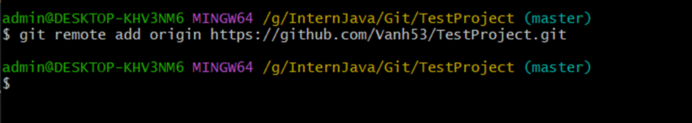
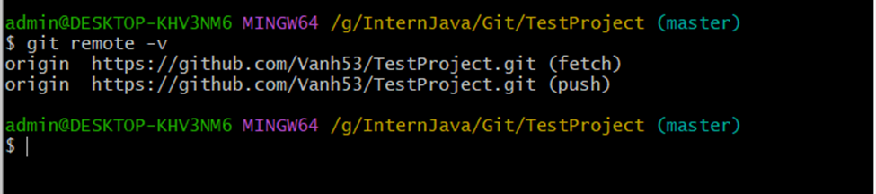
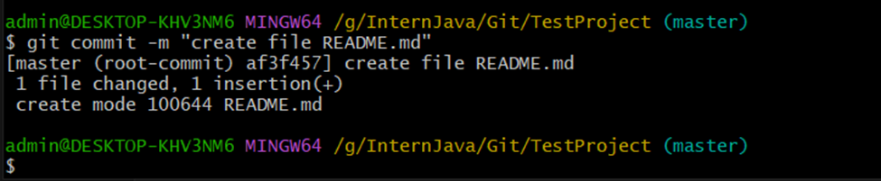
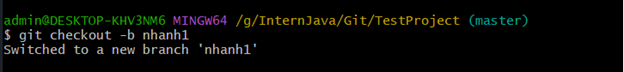
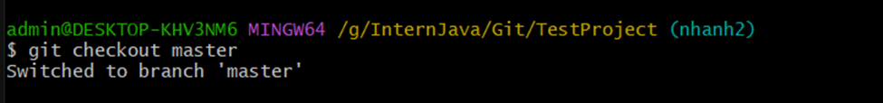
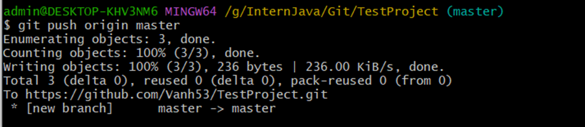

- Liên kết kho lưu trữ **cục bộ** với kho lưu trữ **từ xa**: git remote add origin https://github.com/Vanh53/TestProject.git

- Liệt kê các kết nối: Git remote -v

- Ghi lại những thay đổi: Git commit -m “create file README.md”

- Tạo và chuyển sang 1 nhánh mới: git checkout -b nhanh1

- Chuyển sang nhánh khác: git checkout master

- Đẩy dữ liệu từ nhánh hiện tại lên kho lưu trữ từ xa: git push origin master
