- Liên kết kho lưu trữ **cục bộ** với kho lưu trữ **từ xa**: git remote add origin https://github.com/Vanh53/TestProject.git

- Liệt kê các kết nối: Git remote -v

- Chuyển đổi giữa HTTPS và SSH: git remote set-url
    - Từ HTTPS chuyển sang SSH 
         
        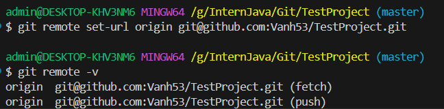
    - Từ SSH chuyển sang HTTPS
         
        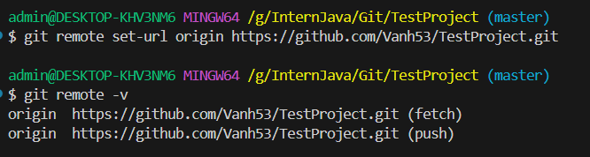

- Đưa thay đổi vào vùng chờ staging:
    - Thêm 1 file: git add README.md
         
       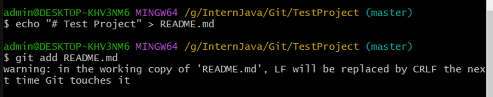
    - Thêm tất cả thay đổi: git add .
         
        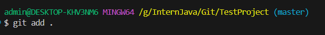

- Ghi lại những thay đổi: Git commit -m “create file README.md”

- Tạo và chuyển sang 1 nhánh mới: git checkout -b nhanh1

- Chuyển sang nhánh khác: git checkout master

- Xem danh sách nhánh: git branch
        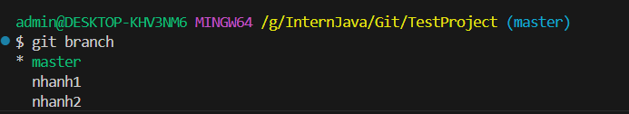

- Đẩy dữ liệu từ nhánh hiện tại lên kho lưu trữ từ xa: git push origin master

- Sử dụng -h hoặc --help để tìm hiểu thêm về 1 lệnh cụ thể
        Ví dụ: 
            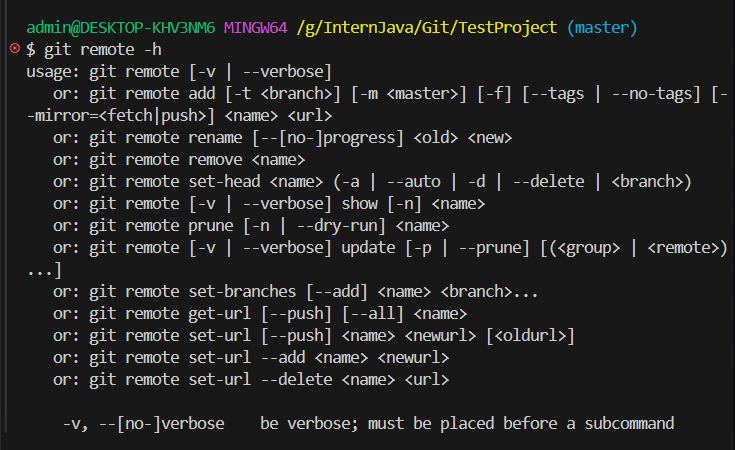

- Hiển thị danh sách các commit: git log
        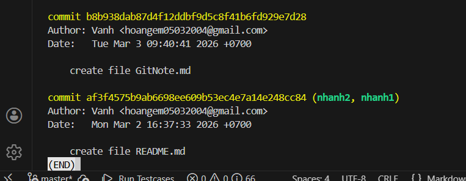

- Hiển thị danh sách commit, mỗi commit trên 1 dòng: git log --oneline
        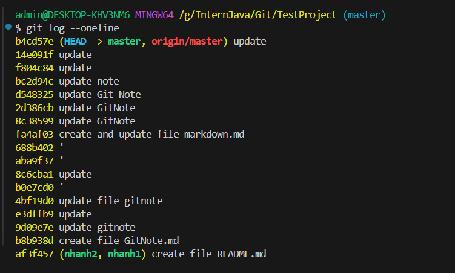

- Đưa thư mục làm việc (Working directory) trở về trạng thái của 1 commit nhất định: git checkout <revision>
    - Ví dụ: git checkout 373a95c
        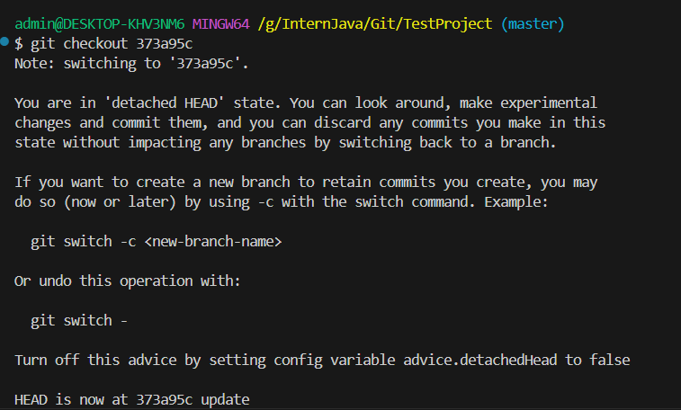
    - Muốn thay đổi từ commit trước -> tạo nhánh mới: git checkout -b ten-nhanh 373a95c

- Đẩy dữ liệu lên kho lưu trữ từ xa và ghi đè (ghi đè tất cả commit trên kho lưu trữ từ xa thành commit trên máy cục bộ): git push --force origin master

- Xóa nhánh: git branch -d nhanh2
        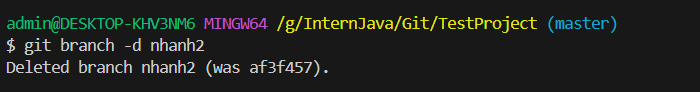

- Đưa file trở về trạng thái commit gần nhất: git checkout -- GitNote.md
    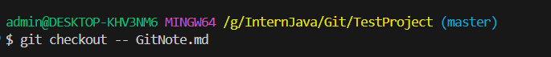

- Lưu lại những thay đổi để chuyển nhánh mà không cần commit, đưa vào danh sách: git stash
    - Lưu lại tất cả: git stash -u (kể cả các file untracked chưa được add hoặc commit)

- Lấy 1 trạng thái từ đầu danh sách và xóa nó khỏi danh sách: git stash pop
- Làm trống danh sách stash: git stash clear
- Xem danh sách stash: git stash list

# SSH và HTTPS
- Tạo cặp key-value giữa máy tính và github: ssh-keygen -t ed25519 -C "hoangem05032004@gmail.com"
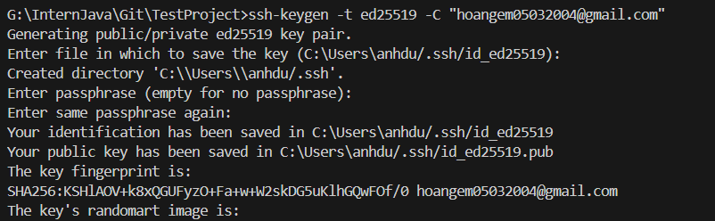

- In nội dung khóa ra màn hình: cat ~/.ssh/id_ed25519.pub
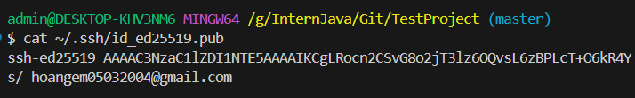

# 4 vùng làm việc
1. vùng làm việc (Working directory) là vùng người dùng thực hiện code

2. vùng chờ (Staging area) là vùng lưu dữ liệu thay đổi (thêm vào bằng add)

3. kho lưu trữ cục bộ (local repository) để lưu dữ liệu trên máy (thêm vào bằng commit)

4. kho lưu trữ từ xa (github, ... ) để lưu dữ liệu từ xa (thực hiện với push)

---
 fetch, pull
Git merge, pull from another branch, merge fast forward vs no-ff vs merge squash

Git reset, reset soft, reset hard, mixed

-- lúc trước
day là vanh-em
-- lúc sau

